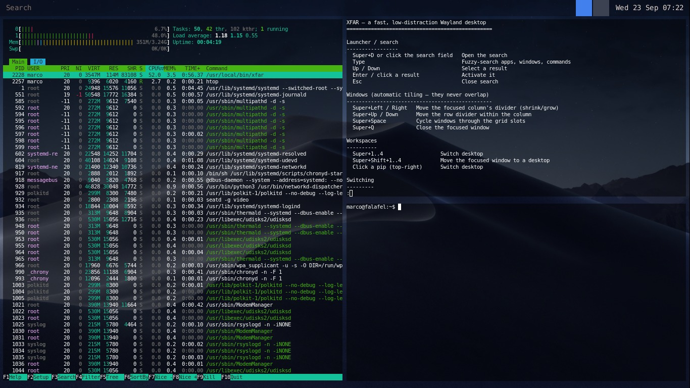

# xfar

`xfar` is a Wayland compositor written in Rust with Smithay. It provides automatic grid tiling, runtime workspaces, and a global launcher. Its only persistent interface is a thin bar containing search, workspace pips, and a clock.



`xfar` is early-stage and is not marked stable for daily-driver use.

## Build and run

The default build runs nested in an existing X11 or Wayland session:

```bash
cargo run
```

The hardware backend requires `seatd`, a Linux TTY, and access to `/dev/dri`:

```bash
cargo run --features tty
```

With the `tty` feature enabled, xfar selects DRM/KMS when neither `WAYLAND_DISPLAY` nor `DISPLAY` is set. Otherwise it uses the nested winit backend.

Validate configuration without starting the compositor:

```bash
cargo run -- validate
```

## Configuration

xfar reads optional TOML from `$XDG_CONFIG_HOME/xfar/config.toml`, falling back to `~/.config/xfar/config.toml`. Every field has a default; unknown sections and keys are rejected.

`xfar validate` checks parsing, ranges, keybindings, colors, and enumerated values without rewriting the file. The `xfar.settings` launcher command provides an editable view of the effective configuration and saves valid changes to disk.

The full reference is available from `xfar.help` in the launcher or in [`docs/xfar.help`](docs/xfar.help).

## Development

Development uses a disposable Ubuntu VM managed from macOS. See [`docs/DEVELOPMENT.md`](docs/DEVELOPMENT.md) for the full workflow.

```bash
brew install --cask multipass
./scripts/vm.sh create
./scripts/vm.sh shell
# Inside the VM:
cd ~/xfar && ./scripts/dev.sh
```

## License

Dual licensed under [Apache License, Version 2.0](LICENSE-APACHE) or the [MIT license](LICENSE-MIT), at your option.
